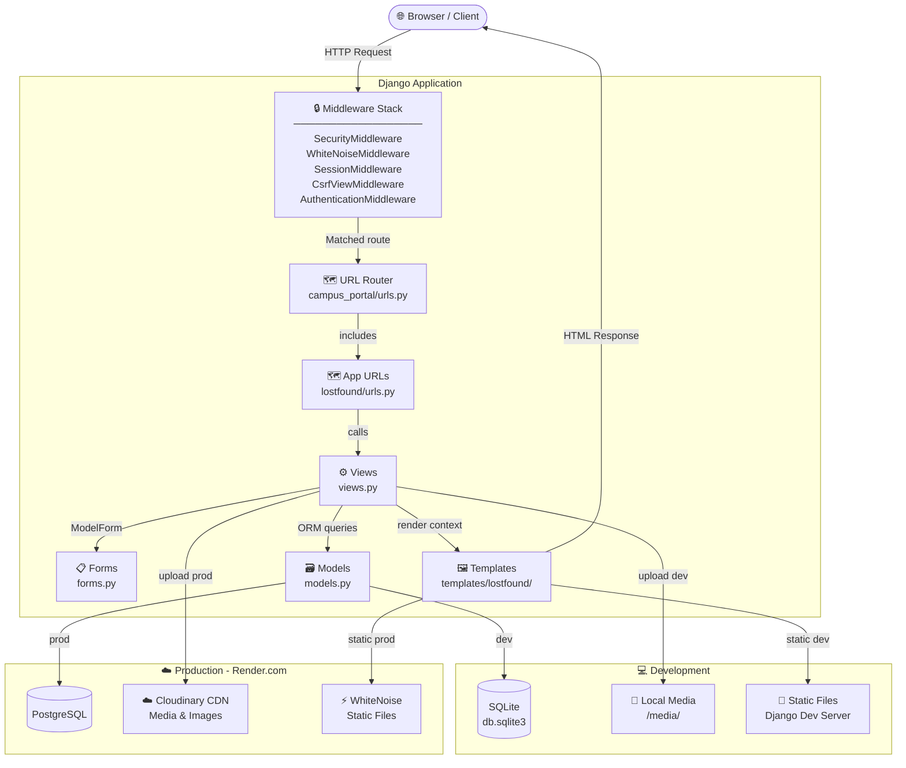
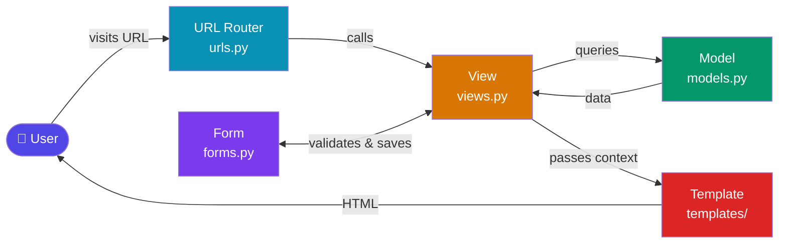
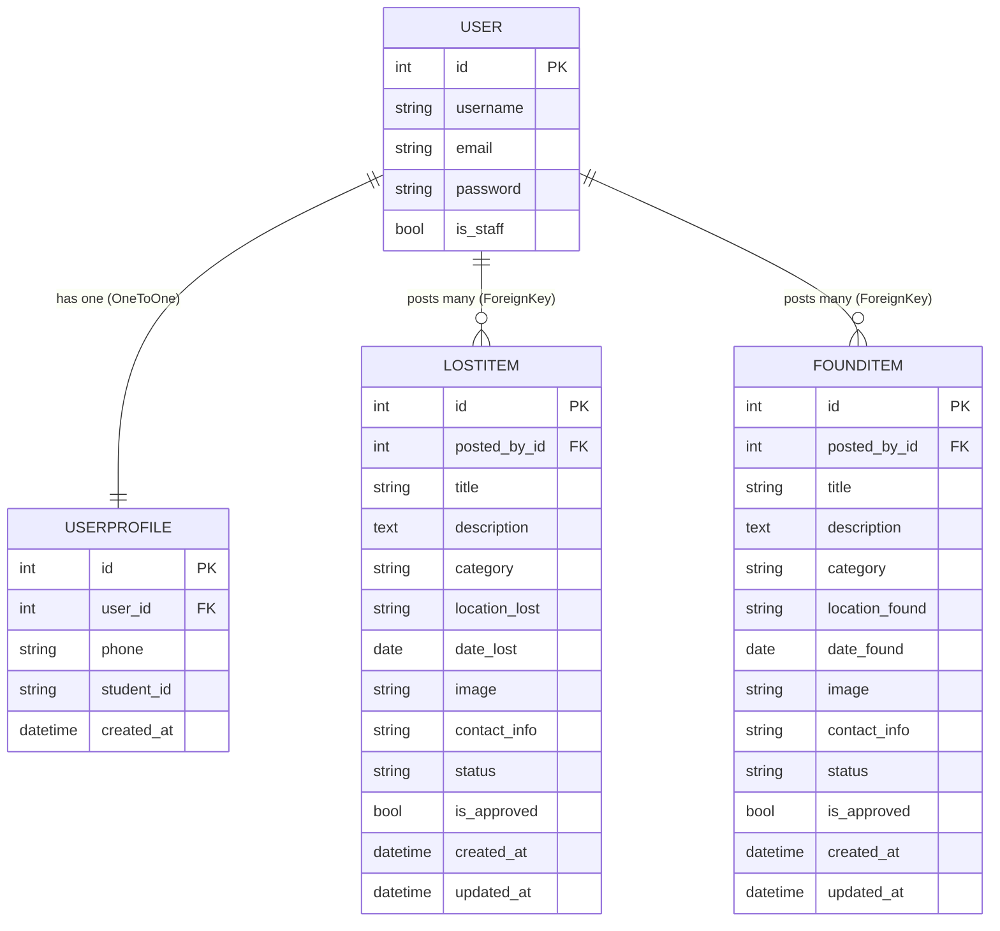
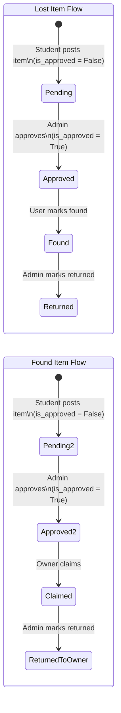

# 🎓 Campus Lost & Found Portal — Interview Preparation Guide

> **Project:** Campus Lost & Found Portal | **Stack:** Django 4.2, SQLite/PostgreSQL, Cloudinary, Render

---

## 📌 30-Second Elevator Pitch

> *"I built a Campus Lost & Found Portal using Django. It allows students to post lost and found items with images, search by keyword or category, and contact each other directly. The system includes admin approval to prevent spam, user authentication, and is deployed on Render with Cloudinary for media storage and PostgreSQL for the production database."*

---

## 🏗️ System Architecture



### MVT Pattern (Django's MVC)



| Layer | File | Role |
|-------|------|------|
| **Model** | `models.py` | Database schema & business logic |
| **View** | `views.py` | Request handling & data processing |
| **Template** | `templates/lostfound/` | HTML rendering |
| **Form** | `forms.py` | Input validation & HTML generation |
| **URL** | `urls.py` | Route mapping |

---

## 🗃️ Database Design

### Entity Relationship Diagram



### Status Lifecycle



### Model Fields Cheat Sheet

| Field Type | Used For | Example |
|------------|----------|---------|
| `CharField` | Short text | title, category |
| `TextField` | Long text | description |
| `BooleanField` | True/False | is_approved |
| `DateField` | Date only | date_lost |
| `DateTimeField(auto_now_add=True)` | Created timestamp | created_at |
| `DateTimeField(auto_now=True)` | Updated timestamp | updated_at |
| `ImageField` | Image upload | image |
| `ForeignKey` | Many-to-one link | posted_by → User |
| `OneToOneField` | One-to-one link | user → User |

---

## 🔐 Authentication Flow

```
Registration:
  POST /register/ → UserRegistrationForm → save User + UserProfile → auto login → redirect home

Login:
  POST /login/ → authenticate(username, password) → login(request, user) → redirect home

Protected Views:
  @login_required decorator → if not logged in → redirect to /login/
```

---

## 🔍 Search Implementation

```python
# URL: /lost-items/?q=iphone&category=electronics
query = request.GET.get('q', '')
category = request.GET.get('category', '')

items = LostItem.objects.filter(is_approved=True)

if query:
    items = items.filter(
        Q(title__icontains=query) | Q(description__icontains=query)
    )

if category:
    items = items.filter(category=category)

items = items.order_by('-created_at')
```

**Key concepts:** `Q objects` for OR queries, `icontains` for case-insensitive search, chaining `.filter()` for AND logic.

---

## 🛡️ Admin Approval Workflow

```
Student posts item → is_approved=False (hidden from public)
        ↓
Admin logs into /admin/
        ↓
Admin checks is_approved checkbox (list_editable)
        ↓
Item now visible on /lost-items/ or /found-items/
```

---

## 🌐 Deployment Stack

| Concern | Development | Production |
|---------|------------|------------|
| Server | `python manage.py runserver` | Gunicorn WSGI |
| Database | SQLite (db.sqlite3) | PostgreSQL (Render) |
| Static Files | Django dev server | WhiteNoise |
| Media Files | Local `/media/` | Cloudinary |
| Platform | Localhost | Render.com |

**Environment Variables used:**
- `SECRET_KEY` — Django secret key
- `DATABASE_URL` — PostgreSQL connection string (via `dj-database-url`)
- `CLOUDINARY_CLOUD_NAME` — switches media/static storage
- `RENDER_EXTERNAL_HOSTNAME` — auto-added to ALLOWED_HOSTS

---

## ❓ Interview Questions & Answers

---

### 🟢 EASY — Project Understanding

**Q1: What does your project do?**
> A Campus Lost & Found Portal where students post lost/found items with photos, search/filter by category, and contact each other. Admins approve posts to prevent spam. Deployed on Render with PostgreSQL and Cloudinary.

**Q2: What technology stack did you use?**
> - **Backend:** Django 4.2 (Python)
> - **Database:** SQLite (dev), PostgreSQL (prod) via `dj-database-url`
> - **Media Storage:** Cloudinary (`django-cloudinary-storage`)
> - **Static Files:** WhiteNoise
> - **Deployment:** Render.com with Gunicorn WSGI server

**Q3: What are the main features?**
> 1. User registration & login (Django's built-in auth)
> 2. Post lost/found items with image upload
> 3. Search by keyword (title/description) and filter by category
> 4. Admin approval system (prevents spam)
> 5. Status tracking (pending → found/returned)
> 6. User profile (phone, student ID)

**Q4: How many models do you have and what are they?**
> Three models:
> - **UserProfile** — extends Django's User with phone & student_id (OneToOne)
> - **LostItem** — stores lost item details (ForeignKey to User)
> - **FoundItem** — stores found item details (ForeignKey to User)

---

### 🟡 MEDIUM — Django & Python Concepts

**Q5: What is Django's MVT pattern?**
> - **Model:** Defines database structure (`models.py`)
> - **View:** Handles HTTP requests, gets data from models, passes to templates (`views.py`)
> - **Template:** HTML files that render data (`templates/`)
> 
> Unlike MVC, Django's "View" is like a Controller, and the "Template" is the View.

**Q6: What is a ForeignKey vs OneToOneField?**
> - **ForeignKey** = One-to-many: One User can have **many** LostItems. If user deleted → all their items deleted (CASCADE).
> - **OneToOneField** = One-to-one: One User has **one** UserProfile. Like a passport — each person has exactly one.

**Q7: What is `on_delete=models.CASCADE`?**
> It tells Django what to do when the referenced object is deleted. `CASCADE` means delete all related objects too. So if a User is deleted, all their LostItems and FoundItems are also deleted automatically.

**Q8: What does `commit=False` do in `form.save(commit=False)`?**
> It creates the model object in memory but doesn't save it to the database yet. This lets us set additional fields (like `posted_by = request.user`) before actually saving. Without it, we couldn't set the user because the form doesn't include that field.

**Q9: What are Q objects in Django?**
> Q objects allow complex database queries with OR / AND / NOT logic.
> ```python
> Q(title__icontains=query) | Q(description__icontains=query)
> ```
> This searches where title contains the query **OR** description contains the query. Regular `.filter()` only does AND.

**Q10: What is `@login_required` decorator?**
> A decorator that protects a view — if the user is not authenticated, they are automatically redirected to the login page (defined by `LOGIN_URL` in settings). After login, they are sent back to the original page.

**Q11: What is `get_object_or_404()`?**
> A Django shortcut that tries to get an object from the database. If it doesn't exist, it automatically returns a 404 HTTP error page instead of crashing with an unhandled exception.

**Q12: What is `auto_now_add` vs `auto_now`?**
> - `auto_now_add=True` — Set automatically **only when the object is first created** (created_at)
> - `auto_now=True` — Updated **every time the object is saved** (updated_at)

**Q13: What is a ModelForm? Why did you use it?**
> A ModelForm automatically creates form fields from a model's fields. Benefits:
> - Auto-generates HTML inputs
> - Handles validation (e.g., required fields, max_length)
> - `form.save()` directly saves to the database
> - Less code than writing forms manually

**Q14: What is CSRF and how does Django handle it?**
> CSRF (Cross-Site Request Forgery) is an attack where a malicious site tricks a user's browser into submitting a form to your site. Django includes `CsrfViewMiddleware` that requires a `` in every POST form. This token is unique per session and verified server-side.

**Q15: What is Django's ORM?**
> Object-Relational Mapper — lets you interact with the database using Python objects instead of raw SQL.
> ```python
> # ORM (what we use)
> LostItem.objects.filter(is_approved=True).order_by('-created_at')
> 
> # Equivalent SQL
> SELECT * FROM lostfound_lostitem WHERE is_approved=1 ORDER BY created_at DESC;
> ```

**Q16: What is middleware in Django?**
> Middleware are components that process **every** request and response. They run in order (top to bottom for requests, bottom to top for responses). Examples in this project:
> - `SecurityMiddleware` — HTTPS redirects, security headers
> - `WhiteNoiseMiddleware` — Serves static files
> - `CsrfViewMiddleware` — CSRF protection
> - `AuthenticationMiddleware` — Attaches `request.user`

**Q17: How does Django's session-based authentication work?**
> 1. User logs in → Django verifies credentials with `authenticate()`
> 2. `login(request, user)` creates a **session** stored in the database
> 3. A **session cookie** is sent to the browser
> 4. On every subsequent request, Django reads the cookie, looks up the session, and sets `request.user`
> 5. `logout()` destroys the session

**Q18: What are migrations and why are they needed?**
> Migrations are Python files that track changes to your models and apply them to the database. 
> - `makemigrations` — detects model changes and creates migration files
> - `migrate` — applies migration files to create/alter database tables
> They act like version control for your database schema.

---

### 🔴 HARDER — Design Decisions & Problem Solving

**Q19: Why did you implement admin approval for posts?**
> To prevent spam and fake listings. Without approval, anyone could post misleading items. The `is_approved=False` default means all new posts are hidden until reviewed. The Django admin's `list_editable` feature lets admins approve/reject with a single click, making moderation efficient.

**Q20: Why did you use `is_approved` as a BooleanField instead of a separate status?**
> Approval is a separate concern from item status. `is_approved` controls **visibility** (admin moderation), while `status` tracks the item's **lifecycle** (still lost → found → returned). Keeping them separate allows an admin to hide an approved item without changing its resolution status.

**Q21: How does your search work? What are its limitations?**
> **Works:** Uses `Q(title__icontains=query) | Q(description__icontains=query)` — case-insensitive substring match in the database.
> 
> **Limitations:**
> - No fuzzy/typo matching (searching "iphne" won't find "iphone")
> - No full-text search ranking
> - No synonym matching
> 
> **Improvements:** Could use PostgreSQL's `SearchVector` / `SearchRank` for full-text search, or integrate Elasticsearch.

**Q22: How does your image upload work?**
> In development: `ImageField(upload_to='lost_items/')` saves files to `MEDIA_ROOT/lost_items/`. The form must have `enctype="multipart/form-data"` and views use `request.FILES`.
> 
> In production: `django-cloudinary-storage` overrides `DEFAULT_FILE_STORAGE`, so all `ImageField` uploads are automatically sent to Cloudinary's CDN instead of the local filesystem. This works because Render's filesystem is ephemeral (files are lost on redeploy).

**Q23: Why use PostgreSQL in production instead of SQLite?**
> SQLite is a file-based database. On platforms like Render, the filesystem is **ephemeral** — files are wiped on every redeploy. SQLite also doesn't handle **concurrent writes** well. PostgreSQL is a proper server-based database that:
> - Persists data independently of deploys
> - Handles concurrent users
> - Scales better
> - Is required by most production hosting platforms

**Q24: How did you switch databases based on environment?**
> ```python
> DATABASES = {'default': {'ENGINE': 'django.db.backends.sqlite3', 'NAME': BASE_DIR / 'db.sqlite3'}}
> 
> database_url = os.environ.get('DATABASE_URL')
> if database_url:
>     DATABASES['default'] = dj_database_url.parse(database_url, conn_max_age=600)
> ```
> In production (Render), `DATABASE_URL` is set as an environment variable pointing to PostgreSQL. `dj-database-url` parses that URL into Django's settings format.

**Q25: What security measures does your project have?**
> 1. **CSRF Protection** — `` in all POST forms
> 2. **Password Hashing** — Django hashes passwords with PBKDF2 by default
> 3. **`@login_required`** — Protected views redirect unauthenticated users
> 4. **Authorization Check** — In `mark_found`, verify `item.posted_by == request.user` before allowing edits
> 5. **SECRET_KEY from env** — `os.environ.get('SECRET_KEY', ...)` — not hardcoded in production
> 6. **DEBUG=False in production** — `DEBUG = 'RENDER' not in os.environ`
> 7. **Password validators** — Minimum length, common password check, similarity check

**Q26: What is `get_or_create()` and where did you use it?**
> ```python
> profile, created = UserProfile.objects.get_or_create(user=request.user)
> ```
> It tries to get an object; if it doesn't exist, it creates it. Returns a tuple `(object, created_bool)`. Used in the `profile` view to handle edge cases where a UserProfile might not exist for a user (e.g., accounts created via admin).

**Q27: How does template inheritance work in your project?**
> `base.html` contains the common layout (navbar, footer, message display). Other templates extend it:
> ```html
> 
> 
>   <!-- page-specific content here -->
> 
> ```
> This avoids repeating the navbar/footer code in every page, following the DRY (Don't Repeat Yourself) principle.

**Q28: What is WhiteNoise and why did you use it?**
> WhiteNoise is a Python library that allows Django to serve its own static files efficiently without needing a separate web server like Nginx. In production, it compresses and caches static files with proper HTTP headers. It's added as middleware before other middleware.

**Q29: How does Gunicorn relate to Django?**
> Django itself is just a Python application — it doesn't handle production web traffic. Gunicorn is a WSGI server that:
> - Receives HTTP requests from the internet
> - Passes them to Django via the WSGI interface (`wsgi.py`)
> - Returns Django's response
> - Handles multiple worker processes for concurrency

**Q30: What would you improve if you had more time?**
> 1. **Email notifications** — notify users when a potential match is found
> 2. **Messaging system** — in-app messaging instead of sharing phone/email
> 3. **Full-text search** — PostgreSQL `SearchVector` for smarter search
> 4. **Image similarity matching** — AI to automatically match lost/found items
> 5. **Pagination** — for large item lists
> 6. **REST API** — so a mobile app can also use the backend
> 7. **Email verification** — prevent fake accounts

---

### 🔵 BEHAVIORAL / PROJECT MANAGEMENT

**Q31: What was the most challenging part of this project?**
> The deployment configuration — switching between SQLite/PostgreSQL and local/Cloudinary storage based on environment variables. Debugging Cloudinary credentials and understanding Render's ephemeral filesystem was challenging. I solved it by reading both the `django-cloudinary-storage` docs and Render's Django deployment guide.

**Q32: What did you learn from this project?**
> 1. Django's full MVT pattern end-to-end
> 2. Database design and ORM relationships
> 3. Django's built-in auth system
> 4. Environment-based configuration for dev/prod
> 5. Cloud storage with Cloudinary
> 6. Deploying a Python web app to a cloud platform

**Q33: How would you scale this for thousands of users?**
> 1. Add **caching** (Redis/Memcached) for frequently accessed items list
> 2. Use **PostgreSQL full-text search** or Elasticsearch
> 3. Add **CDN** (already using Cloudinary for media)
> 4. **Paginate** results to avoid loading all items
> 5. Add **database indexes** on commonly filtered fields (category, is_approved)
> 6. Use **async views** with Django's async support for I/O-bound tasks

---

## 📋 Key Code Snippets — Know These Cold

### 1. Post a Lost Item (commit=False pattern)
```python
@login_required
def post_lost_item(request):
    if request.method == 'POST':
        form = LostItemForm(request.POST, request.FILES)
        if form.is_valid():
            lost_item = form.save(commit=False)  # Don't save to DB yet
            lost_item.posted_by = request.user   # Set the owner
            lost_item.save()                     # Now save
            messages.success(request, 'Post submitted for admin approval.')
            return redirect('lost_items_list')
    else:
        form = LostItemForm()
    return render(request, 'lostfound/post_lost.html', {'form': form})
```

### 2. Search with Q Objects
```python
items = LostItem.objects.filter(is_approved=True)
if query:
    items = items.filter(Q(title__icontains=query) | Q(description__icontains=query))
if category:
    items = items.filter(category=category)
items = items.order_by('-created_at')
```

### 3. Authorization Check
```python
@login_required
def mark_found(request, pk):
    item = get_object_or_404(LostItem, pk=pk)
    if item.posted_by != request.user:        # Authorization check
        messages.error(request, "Not authorized.")
        return redirect('lost_item_detail', pk=pk)
    if request.method == 'POST':
        item.status = 'found'
        item.save()
```

### 4. Model Relationships
```python
# OneToOne: One User → One Profile
user = models.OneToOneField(User, on_delete=models.CASCADE)

# ForeignKey: One User → Many LostItems
posted_by = models.ForeignKey(User, on_delete=models.CASCADE)
```

### 5. Environment-based Configuration
```python
DEBUG = 'RENDER' not in os.environ
SECRET_KEY = os.environ.get('SECRET_KEY', 'django-insecure-dev-key')

if os.environ.get('DATABASE_URL'):
    DATABASES['default'] = dj_database_url.parse(os.environ.get('DATABASE_URL'))

if os.environ.get('CLOUDINARY_CLOUD_NAME'):
    DEFAULT_FILE_STORAGE = 'cloudinary_storage.storage.MediaCloudinaryStorage'
```

---

## ⚡ Quick-Fire Answers

| Question | Answer |
|----------|--------|
| What command starts Django server? | `python manage.py runserver` |
| How to create DB tables? | `makemigrations` then `migrate` |
| How to create admin user? | `python manage.py createsuperuser` |
| What is `pk`? | Primary Key — unique auto-generated ID |
| What does `[:6]` do in a queryset? | Limits results to first 6 (like SQL `LIMIT 6`) |
| What is `request.POST`? | Dictionary of data sent via POST form |
| What is `request.GET`? | Dictionary of URL query parameters (`?q=...`) |
| What is `request.FILES`? | Dictionary of uploaded files |
| What is a context dict? | Data passed from view to template |
| What is `messages.success()`? | Displays a one-time flash message |
| Where are static files served from in dev? | Django's dev server |
| Where are static files served from in prod? | WhiteNoise |
| What is `MEDIA_ROOT`? | Directory where uploaded files are stored |
| What is `ALLOWED_HOSTS`? | Domains allowed to serve the Django app |
| Why `blank=True, null=True` on image? | Makes the field optional (in Python and DB) |

---

## 🔗 URL Structure

| URL | View | Login Required |
|-----|------|----------------|
| `/` | `home` | No |
| `/register/` | `register` | No |
| `/login/` | `login_view` | No |
| `/logout/` | `logout_view` | No |
| `/profile/` | `profile` | ✅ Yes |
| `/post-lost/` | `post_lost_item` | ✅ Yes |
| `/post-found/` | `post_found_item` | ✅ Yes |
| `/lost-items/` | `lost_items_list` | No |
| `/found-items/` | `found_items_list` | No |
| `/lost-item/<id>/` | `lost_item_detail` | No |
| `/found-item/<id>/` | `found_item_detail` | No |
| `/item/<id>/mark-found/` | `mark_found` | ✅ Yes |
| `/admin/` | Django Admin | ✅ Staff only |

---

## 💡 Good Questions to Ask the Interviewer

1. *"What Django version is your team currently using, and do you use class-based or function-based views?"*
2. *"How does your team handle database migrations in CI/CD pipelines?"*
3. *"Are you using any caching layer like Redis with your Django applications?"*
4. *"Do you use Django REST Framework for your APIs, or GraphQL?"*

---

> **Best of luck tomorrow! You've got this! 🚀**
