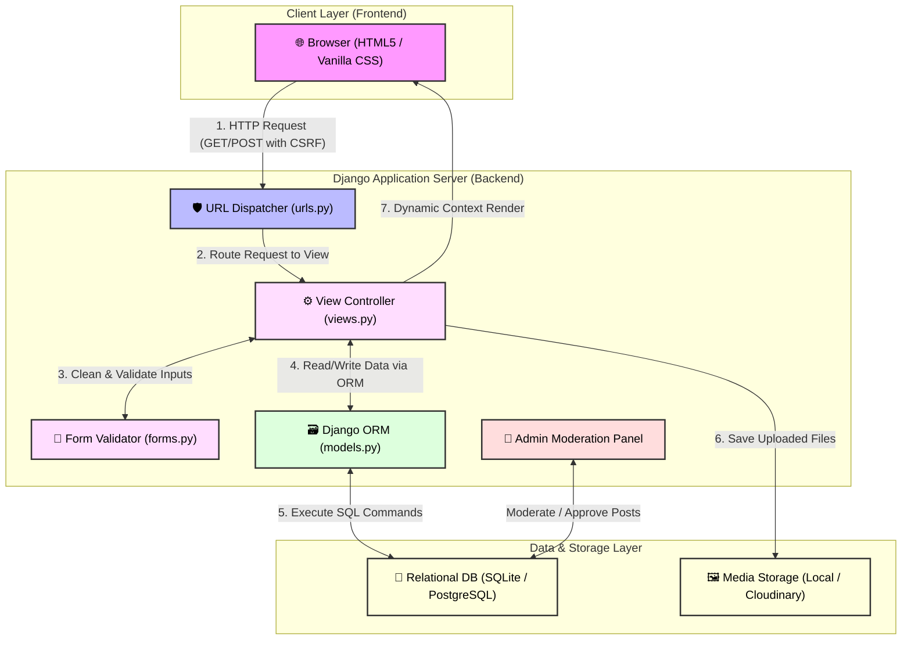
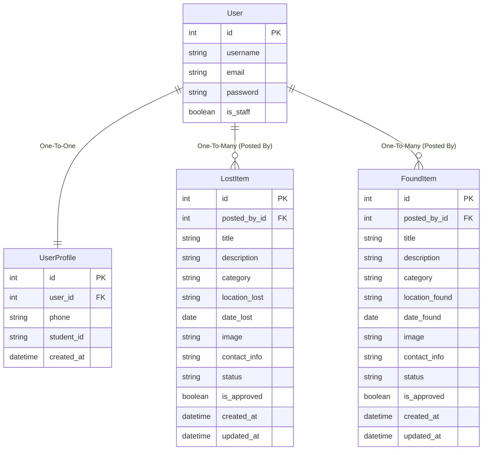

# Campus Lost & Found Portal - System Architecture & Interview Guide

Welcome! This document provides a highly professional, comprehensive breakdown of the application architecture, data models, key design choices, and a complete interview preparation guide.

---

## 🏛️ System Architecture Diagram

This web application is built on top of **Django**, utilizing the industry-standard **MVT (Model-View-Template)** architecture—a powerful, robust variation of the traditional MVC (Model-View-Controller) design pattern.

Below is the conceptual and structural diagram of how components communicate in our system:



---

## 🧩 Architectural Component Breakdown

### 1. The Client Layer (Templates - Front-end)
* **Technology**: Semantic HTML5, Vanilla CSS, and Django Template Engine variables (`{{ item.title }}`) and logic tags (``).
* **Responsibilities**:
  * Render interfaces for users to register, login, view dashboards, search, and submit forms.
  * Implement template inheritance via a base template (`base.html`), minimizing code duplication.
  * Securely submit user inputs using HTML5 forms with embedded `` tags.
  * Multi-part form encoding (`enctype="multipart/form-data"`) to enable image uploads.

### 2. The URL Dispatcher (`urls.py` - Router)
* **Responsibilities**:
  * Act as the front gate of the server.
  * Match incoming HTTP requests (URLs) to their corresponding view controller functions in `views.py`.
  * Extract URL path parameters (e.g., `<int:pk>` in `lost-items/<int:pk>/`) and pass them to views as primary keys.

### 3. The Forms Layer (`forms.py` - Validation & Security)
* **Responsibilities**:
  * Generate HTML input elements automatically based on model structures via `ModelForm`.
  * Enforce server-side security validation, checking field lengths, required inputs, email formats, and file types before writing to the database.
  * Inject custom CSS classes (e.g., `form-control` for Bootstrap/custom stylesheets) to keep form styling uniform.

### 4. The Business Logic Controller (`views.py` - Views)
* **Responsibilities**:
  * Coordinate actions, process sessions, and control routing.
  * **Authentication & Authorization**: Decides who can perform which actions. Protects critical pages using `@login_required` decorators.
  * **Database Interaction**: Coordinates with the Django ORM to query or save data.
  * **Spam Prevention System**: Sets default status to `is_approved=False` for all user-submitted lost and found items.
  * **Context Merging**: Packages database results into a context dictionary and calls `render(request, 'template.html', context)` to deliver dynamic HTML to the user.

### 5. The Models Layer (`models.py` - Database Schema / ORM)
* **Responsibilities**:
  * Define our data entities, tables, relationships, and constraints in high-level Python code.
  * Utilize Django's Object-Relational Mapper (ORM) to automatically translate Python objects into SQL queries, keeping the code database-agnostic.

---

## 🗄️ Database & Schema Design

The application utilizes three primary models linked via standard relational constraints.



### Key Relational Features
1. **One-to-One (`User ↔ UserProfile`)**: Maps a single standard Django authentication user to their campus-specific metadata (Student ID, Phone Number).
2. **Many-to-One / Foreign Key (`User ↔ LostItem / FoundItem`)**: Captures that a student can post multiple items, but each item belongs to exactly one user.
3. **On-Delete Cascade (`on_delete=models.CASCADE`)**: Crucial data integrity rule. If a user account is deleted from the campus system, all of their related lost and found listings are automatically purged to prevent orphaned data.

---

## 🔄 End-to-End Request-Response Flow

To explain how the application handles requests, let’s trace **how a student posts a Lost Item**:

```
[Student in Browser] 
    1. Fills form and clicks "Submit"
    2. POST Request (Form Data + Image File + CSRF Token) sent to /lost-items/post/
           ↓
[Django URL Router (urls.py)]
    3. Matches path /lost-items/post/ to view function `post_lost_item`
           ↓
[Views Controller (views.py: post_lost_item)]
    4. Instantiates LostItemForm(request.POST, request.FILES)
    5. Validates: form.is_valid()
           ├─ If INVALID ──> Re-renders the form with inline validation errors
           └─ If VALID ────> Continues
    6. Saves object with commit=False: lost_item = form.save(commit=False)
    7. Injects logged-in user: lost_item.posted_by = request.user
    8. Saves to DB: lost_item.save() (sets is_approved=False by default)
    9. Queues success toast message: messages.success(request, 'Submitted!...')
           ↓
[Browser Redirect]
    10. View returns HTTP Redirect to the dashboard.
```

---

## 🎓 Ultimate Technical Interview Q&A

Use these detailed answers to impress your interviewers and show depth of engineering knowledge:

### Q1: Django uses "MVT" rather than "MVC". What is the difference, and what acts as the Controller in Django?
> **Answer**: 
> "MVT stands for **Model-View-Template**. In standard MVC (Model-View-Controller), the *Controller* handles routing and user interaction, while the *View* displays the UI. 
> 
> In Django, the **Framework itself** acts as the Controller—taking care of URL routing, request parsing, and middleware. The **Django View** is equivalent to the MVC *Controller* because it contains the business logic, fetches data, and makes decisions. The **Django Template** acts as the MVC *View*, containing the presentation logic and generating HTML."

### Q2: How did you design the database schemas, and why did you extend the Django `User` model with a `UserProfile` model instead of rewriting it?
> **Answer**: 
> "I designed the system with data separation and normalization in mind. I used standard relational schemas containing `User`, `UserProfile`, `LostItem`, and `FoundItem` tables. 
> 
> I extended Django’s built-in `User` model using a `OneToOneField` mapping to a `UserProfile` rather than modifying the core `User` model. This is a Django best practice. It allowed me to leverage Django’s pre-packaged authentication, hashing algorithms, and session management while clean-separating campus-specific attributes (like `student_id` and `phone`) without risking breaking standard Django libraries or upgrades."

### Q3: How does your application protect against Cross-Site Request Forgery (CSRF) attacks?
> **Answer**: 
> "Django has robust security defaults. To prevent CSRF attacks, the application uses Django's **CSRF Middleware**. 
> 
> When rendering a form in a template, we embed ``. When compiling the page, Django generates a unique, cryptographically secure token tied to the user's current session. When the form is submitted via POST, the middleware inspects the request headers and payload for this token, comparing it with the session token. If they do not match or the token is missing, the request is rejected immediately with a `403 Forbidden` error, protecting users against malicious cross-domain post requests."

### Q4: How is user moderation and spam control handled on the platform?
> **Answer**: 
> "To prevent spam and inappropriate listings on a public campus portal, I implemented a **Moderation Pipeline**. 
> 
> The `LostItem` and `FoundItem` models have an `is_approved` boolean field which defaults to `False`. When a user submits an item, it is written to the database but excluded from public lists using ORM filters like `.filter(is_approved=True)`.
> 
> Campus staff log into the built-in **Django Admin Panel** (which I registered these models with in `admin.py`), where they can view pending posts, verify content, and toggle `is_approved` to `True`. Once toggled, the item immediately renders on public pages."

### Q5: How are search queries implemented, and how do you ensure the search is fast and efficient?
> **Answer**: 
> "Search is handled dynamically in our list views using Django's **Q Objects** and case-insensitive lookup queries. 
> 
> For example, when a user enters a keyword, we grab it from the request's GET parameters and apply a database query using `Q(title__icontains=query) | Q(description__icontains=query)`. Using `Q` objects allows us to write complex SQL `OR` statements in clean Python.
> 
> To optimize this for scale in production, we can add `db_index=True` on fields that are frequently queried, such as `title`, or implement full-text search indices like Postgres' GIN indexes, ensuring search speeds remain sub-millisecond as listings grow."

### Q6: How does the application handle image uploads, and how would you adapt this for production?
> **Answer**: 
> "We handle image uploads using Django’s `ImageField` and the `Pillow` library for image decoding and verification. 
> 
> In development, uploaded files are written to local disk directories inside the `media/` folder, and the DB table only stores a lightweight path string referencing the file. 
> 
> However, storing media files locally on a web server is an anti-pattern for production because servers are ephemeral and load-balanced. For production, I added `django-cloudinary-storage` to the requirements. Uploaded files bypass local disks and are streamed directly to Cloudinary (or AWS S3/Azure Blob), which serves them globally via a Content Delivery Network (CDN) for optimal page speed."

---

## 🎯 Strategic Interview Advice for the Candidate
1. **Explain the Architecture First**: Start your answer by explaining MVT. Show them you understand the big picture before diving into model fields or views.
2. **Mention Security and Best Practices**: Interviewers love candidates who prioritize security. Talk about `csrf_token`, `@login_required`, and `on_delete=models.CASCADE`.
3. **Use "Senior Dev" Terminology**: Instead of saying *"I made a database table"*, say *"I designed a normalized relational schema with Cascade on-delete integrity constraints."* Instead of saying *"I send data to the page"*, say *"I fetch models using the Django ORM and pass the serialized context to the template renderer."*

You are fully prepared. Good luck with your interview! 🚀
