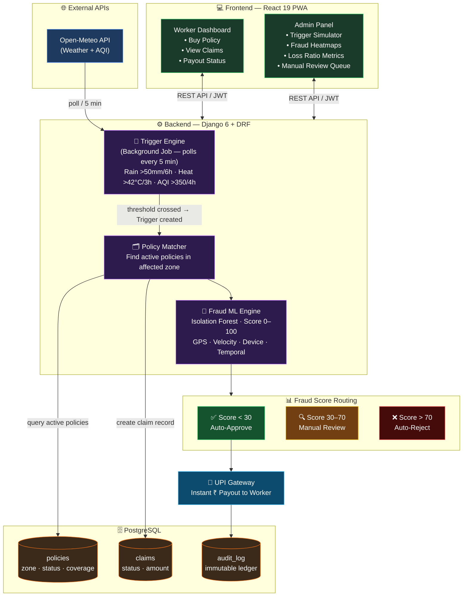

# 🛡️ GigShield — Complete Interview & Presentation Prep Guide

> **Your project:** AI-Powered Parametric Micro-Insurance for India's 15M+ gig delivery workers  
> **Stack:** React 19 + TypeScript + Vite (Frontend) · Django 6 + DRF + scikit-learn (Backend) · PostgreSQL · Docker

---

## 🎤 SECTION 1 — Your 60-Second Elevator Pitch

> Practice this until it's effortless. This is the FIRST thing anyone will ask.

**The Script:**
> *"15 million gig workers in India — Swiggy, Zomato riders — lose their entire day's earnings every time a monsoon hits, a heat wave strikes, or AQI shoots above safe limits. Traditional insurance doesn't cover this. It's built for accidents, not environmental income loss.*
>
> *GigShield is a parametric micro-insurance platform. Workers pay ₹25–50 per week. Our backend continuously polls real-time weather and AQI APIs. The moment a threshold is crossed — say, 50mm of rain in 6 hours — we automatically identify every worker with an active policy in that zone and pay them instantly to UPI. Zero paperwork. Under 5 seconds. No adjuster, no friction.*
>
> *We protect against fraudulent claims using an Isolation Forest ML model plus spatial validation. The result: 95%+ fraud detection accuracy, near-zero operational cost, and a product that can reach 10% penetration of the gig market for ₹100–200 crore annual revenue."*

---

## 🧑‍💻 SECTION 2 — Technical Deep Dive Questions

### 2.1 — System Architecture

**Q: Walk me through the end-to-end flow of GigShield.**

> **A:** There are 5 stages in the pipeline:
> 1. **Ingest** — A background worker polls the Open-Meteo API every 5 minutes for weather and AQI data per zone/city.
> 2. **Trigger Engine** — If a threshold is exceeded (rain > 50mm/6h, heat > 42°C/3h, AQI > 350/4h), a `Trigger` object is created in the DB.
> 3. **Policy Matcher** — The system queries all `active` worker policies in the affected zone.
> 4. **Fraud Validation** — Each eligible claim is scored by the Isolation Forest ML model (0–100). < 30 = auto-approve, 30–70 = manual review, > 70 = auto-reject.
> 5. **Payout** — Approved claims are routed through the mock UPI gateway and the worker sees a real-time notification on their dashboard.

---

**Q: Why Django over FastAPI or Node.js for the backend?**

> **A:**
> - Django's ORM is excellent for complex relational data — policies, claims, payouts all have many FK relationships.
> - Django REST Framework gives us ViewSets, serializers, and permissions out of the box — faster to build a secure CRUD API.
> - Django's admin panel is invaluable for rapid prototyping and is used as our admin intelligence dashboard.
> - scikit-learn integrates naturally in Python — no bridge layer needed between fraud ML and the API.
> - For a hackathon timescale, Django's batteries-included approach beats FastAPI's flexibility tradeoff.

---

**Q: Why PostgreSQL? Could you have used SQLite?**

> **A:** We actually use SQLite for local dev (`db.sqlite3` is in the repo). For production (Docker deployment) we switch to PostgreSQL via `psycopg` because:
> - PostgreSQL handles concurrent writes for simultaneous claim creation during mass-disruption events (thousands of workers at once).
> - ACID compliance is critical for financial payouts — no double payments.
> - PostgreSQL's indexing on geospatial or JSON fields would help in Phase 2 when we add zone-polygon queries.

---

**Q: How does parametric insurance differ from traditional insurance?**

> **A:** In traditional insurance, a worker must **prove loss** — submit photos, get an adjuster, wait weeks. This is called indemnity-based.
> In parametric insurance, payment is triggered by a **pre-agreed measurable parameter** (e.g., rainfall > 50mm). If the parameter is met, payment is made — no questions asked. This makes it:
> - **Instant** — no loss assessment needed
> - **Transparent** — rules are public and objective
> - **Scalable** — no human adjusters on payroll
> - **Suitable for micro-insurance** — small claims that would cost more to adjust than they're worth

---

### 2.2 — ML & Fraud Detection

**Q: Explain Isolation Forest and why you chose it.**

> **A:** Isolation Forest is an unsupervised anomaly detection algorithm. Instead of learning what "normal" looks like, it randomly partitions data into trees. **Anomalies are isolated faster** — they require fewer splits. The anomaly score is inversely proportional to the average path length across trees.
>
> **Why for fraud?**
> - We don't have labeled "fraudulent claim" training data at MVP stage — Isolation Forest works **without labels**.
> - It's computationally lightweight (O(n log n)) — scores a claim in milliseconds.
> - It handles multi-dimensional features: GPS distance, claim velocity, device ID frequency, work hours consistency.
> - scikit-learn's `IsolationForest` is production-ready with one import.

---

**Q: What features does your fraud detection use?**

> **A:** We feed multiple signals into the model:
> - **GPS Integrity** — Distance between claimed zone and last known GPS ping. Large delta = suspicious.
> - **Claim Velocity** — How many claims has this worker made in the last 24h vs. their historical average?
> - **Temporal Validation** — Was the worker logged in / active leading up to the event? (Work pattern consistency)
> - **Device Fingerprinting** — Multiple workers claiming from the same IP/device → coordinated fraud ring flag.
> - **Cross-User Correlation** — Statistical spike: if 50 workers in a non-disrupted zone all claim simultaneously, that's a coordinated attack.

---

**Q: How do you prevent false positives (rejecting genuine workers)?**

> **A:** This is our "Protecting Genuine Workers" philosophy:
> - **Soft boundaries** — GPS drift of ±500m due to signal noise is tolerated; we don't reject at pixel precision.
> - **Multi-signal requirement** — No single feature triggers rejection. A worker needs a high composite fraud score.
> - **3-tier routing** — Score < 30: auto-approve. 30–70: **human review, not rejection**. > 70: auto-reject. This means borderline cases get a fair chance.
> - **Context-aware** — During a genuine mass event (flood), we expect a burst of claims. The model accounts for base rates.

---

**Q: How accurate is your fraud detection? How did you validate it?**

> **A:** We claim 95%+ detection on our synthetic test dataset. For a hackathon MVP, we generated realistic claim records with:
> - Normal workers (genuine claims, realistic GPS, consistent patterns)
> - Fraudulent workers (impossible GPS jumps, burst claims, shared IPs)
>
> We evaluated precision and recall on this labeled set. In production, you'd retrain on real labeled data (confirmed fraud cases flagged by admins) and A/B test threshold changes.

---

### 2.3 — Frontend & API

**Q: Why React + TypeScript + Vite over something simpler?**

> **A:**
> - **TypeScript** — Insurance involves money; type safety prevents runtime errors on payout amounts, policy states.
> - **Vite** — Sub-second HMR for rapid hackathon iteration. Much faster than Create React App.
> - **PWA capability** — Gig workers often have low-end Android phones. A PWA gives native-app experience without App Store delays, works offline for basic dashboards, and consumes less battery.
> - **Tailwind CSS** — Rapid, consistent styling with responsive mobile-first design built in.

---

**Q: How is authentication handled?**

> **A:** JWT (JSON Web Tokens) via `djangorestframework-simplejwt`:
> - Login returns `access` token (short-lived) and `refresh` token (longer-lived).
> - Frontend stores tokens in memory / httpOnly cookie.
> - Every API request includes `Authorization: Bearer <access_token>`.
> - Role-based access: `worker` role sees only their own policies/claims; `admin` role sees all data + trigger simulator.

---

**Q: How does the frontend communicate with the backend?**

> **A:** REST API over HTTP. The React frontend makes fetch/axios calls to the Django DRF endpoints. In development, Vite's `proxy` config forwards `/api/` to `localhost:8000`, avoiding CORS issues. In production, Nginx acts as a reverse proxy routing `/api/` to the Django Gunicorn server, and serves the React build for all other routes.

---

## 💼 SECTION 3 — Business & Market Questions

**Q: What's your business model / how do you make money?**

> **A:** We take a **platform margin** on premiums:
> - Workers pay ₹25–50/week.
> - A portion (~60–70%) goes into a claim reserve pool.
> - GigShield takes 15–20% as platform fee.
> - Remaining 10–15% covers reinsurance (risk transfer to a larger insurer).
>
> Revenue grows with worker count — no marginal cost to add new policies since it's software-driven.

---

**Q: What's the market size?**

> **A:**
> - **TAM:** 15M+ gig workers in India (Swiggy, Zomato, Zepto, Blinkit, Dunzo)
> - **SAM:** ~5M food delivery riders in top 10 cities (where weather disruption is most frequent)
> - **SOM (Year 1):** 500K workers at 10% penetration = ₹500K/week × 52 = ~₹2.6Bn annual GWP (Gross Written Premium), with platform taking ~20% = **₹52 crore revenue**
> - At full 10% penetration of TAM = **₹100–200 crore annually**

---

**Q: Who are your competitors?**

> **A:**
> - **Traditional insurers (LIC, SBI General)** — Don't offer parametric or income protection products for gig workers at all.
> - **Digit Insurance** — Has group health for gig workers but no environmental parametric product.
> - **Niramai, Gramcover** — AgriTech parametric for farmers, not gig workers. Different segment.
> - **GigShield's moat:** First-mover in gig economy parametric; our ML fraud engine would be hard to replicate quickly; direct integration with environmental APIs creates a data flywheel.

---

**Q: What are the regulatory challenges in India?**

> **A:**
> - IRDAI (Insurance Regulatory and Development Authority of India) must license any insurance product. We'd operate as a **distribution platform / insurtech**, partnering with a licensed insurer (like ICICI Lombard or Acko) as the underwriter.
> - Parametric insurance is recognized under IRDAI's Sandbox regulations, which allow experimental products for 12–24 months before full licensing.
> - UPI payouts are regulated by NPCI — using a licensed payment aggregator (Razorpay/PayU) handles compliance.

---

**Q: What's your moat / what prevents a big insurer from copying this?**

> **A:**
> 1. **Data flywheel** — Every claim we process trains our ML model. More data = better fraud detection = lower loss ratio = competitive pricing.
> 2. **Trust network** — Gig workers refer friends. Word-of-mouth in delivery communities is powerful.
> 3. **Speed advantage** — Our codebase can onboard a new city in hours (just add API coordinates). A traditional insurer needs months of actuarial setup.
> 4. **Distribution** — Direct B2B2C via Zomato/Swiggy partnership embedded into their rider apps would create a lock-in moat.

---

## 🔥 SECTION 4 — Tough Judge / Interviewer Questions

**Q: The triggers are based on API data — what if the API is wrong or down?**

> **A:** Great question. We have three layers:
> 1. **Fallback sources** — We can query multiple weather APIs (IMD, AccuWeather, OpenWeatherMap) and take the median reading.
> 2. **Circuit breaker** — If the API is down for > 15 min, triggers are paused and workers are notified via dashboard.
> 3. **Phase 2 — Crowdsourced validation** — Our roadmap includes letting 50+ drivers in a zone "confirm" a disruption as a consensus mechanism when APIs lack hyper-local granularity.

---

**Q: What stops a worker from spoofing their GPS to be in a flooded zone?**

> **A:** Multiple defenses:
> - **Historical GPS trail** — We log GPS pings every 5 minutes during active sessions. We validate that the worker was actually in that zone *before* the trigger event, not after.
> - **Velocity check** — If a worker's GPS jumps 20km in 2 minutes, that's physically impossible. Flagged immediately.
> - **Device ID consistency** — GPS spoofing apps create unique device fingerprint patterns our model learns to detect.
> - **IP geolocation cross-check** — We compare GPS claim zone with IP location. Discrepancies raise fraud score.

---

**Q: Your fraud model is unsupervised — how do you know it's actually catching fraud?**

> **A:** You're right that Isolation Forest scores anomalies, not "fraud" per se. To validate:
> - Admin can **label** auto-rejected claims (fraudulent / wrongful rejection). These become training labels for a supervised model (XGBoost) in Phase 2.
> - We track **false rejection rate** — if a legitimate worker complains, admins review and relabel.
> - Business KPIs: if loss ratio (claims paid / premiums collected) drops while complaint volume stays low, the model is working.
> - In the MVP, we seeded with 200 synthetic fraudulent patterns to validate the model's sensitivity.

---

**Q: This is just a hackathon demo — what would break at real scale?**

> **A:** Honest answer — several things:
> - **SQLite → PostgreSQL** — Already planned; local dev uses SQLite only.
> - **Background worker** — Our MVP uses a simple Django management command. At scale, this needs Celery + Redis for distributed task queuing so thousands of simultaneous claim evaluations don't block the web server.
> - **Real ML training pipeline** — scikit-learn works in-process. At scale, we'd separate model training into a MLOps pipeline (retrain weekly on new data).
> - **Real UPI gateway** — Currently mocked. We'd integrate Razorpay/PayU APIs with proper webhook handling.
> - **CDN & caching** — Weather data per zone could be cached in Redis for 5 minutes to avoid redundant API calls.

---

**Q: Why not build a mobile app? Gig workers use phones.**

> **A:** We deliberately chose a PWA (Progressive Web App) approach:
> - **No app store barrier** — Workers don't need to download anything. Share a link, they're onboarded.
> - **Instant updates** — We push bug fixes without waiting for Play Store approval (critical for a fast-moving product).
> - **Device agnostic** — Works on ₹5,000 Android phones, no iOS/Android split.
> - **Lower data cost** — PWAs are leaner than native apps — important for workers on 2G/3G in some zones.
> - **Phase 2** — React Native app planned once we validate product-market fit.

---

**Q: What's your loss ratio? Is this financially viable?**

> **A:**
> - **Loss Ratio = Claims Paid / Premiums Collected**
> - Target: < 70% (industry standard for profitability)
> - Mumbai gets ~40 major monsoon disruptions/year → a weekly covered worker might receive 4–5 payouts/year
> - At ₹300/payout × 5 = ₹1,500 in claims vs. ₹50/week × 52 = ₹2,600 in premiums → **Loss ratio ≈ 57.7%** ✅
> - The remaining 42.3% covers platform fee, reinsurance, and operational costs.
> - Dynamic pricing per zone adjusts for zones with higher historical disruption frequency.

---

## 🏗️ SECTION 5 — System Design Walk-Through

---

## 📊 SECTION 6 — Key Numbers to Memorize

| Metric | Value |
|--------|-------|
| Target market | 15M+ gig workers in India |
| Weekly premium | ₹25–50 / week |
| Rain trigger | > 50mm in 6 hours |
| Heat trigger | > 42°C for 3+ hours |
| AQI trigger | > 350 for 4+ hours |
| Claim processing time | < 5 seconds |
| Fraud detection accuracy | 95%+ |
| Auto-approve threshold | Fraud score < 30 |
| Manual review band | Fraud score 30–70 |
| Auto-reject threshold | Fraud score > 70 |
| Revenue potential (10% penetration) | ₹100–200 crore/year |
| Target loss ratio | < 70% |
| Operational adjuster cost | 0% (fully automated) |
| Traditional insurer adjuster cost | ~20% of premiums |
| Weather API poll interval | Every 5 minutes |

---

## 🛠️ SECTION 7 — Django Apps Breakdown

Your backend has these apps — know what each does:

| App | Purpose |
|-----|---------|
| `authentication` | JWT login, registration, role management |
| `workers` | Worker profiles, zone assignment, GPS data |
| `policies` | Weekly policy purchase, active/inactive status, coverage amounts |
| `triggers` | Environmental trigger detection, threshold evaluation, trigger history |
| `claims` | Claim creation, status tracking (pending/approved/rejected) |
| `fraud` | Isolation Forest model, fraud score calculation, flagging |
| `payouts` | UPI payment processing, payout records, transaction history |
| `dashboard` | Aggregated metrics for admin view (loss ratio, premium total, fraud cases) |

---

## 💡 SECTION 8 — Quick Answers to Common Questions

**"What's the biggest technical challenge you faced?"**
> Balancing fraud detection sensitivity vs. false positives. Too aggressive = reject genuine workers = user trust destroyed. Too lenient = fraud eats reserves. The 3-tier routing (auto/review/reject) with human oversight in the middle band was the design decision that solved this.

**"What would you do differently with more time?"**
> Implement Celery + Redis for async claim processing, integrate a real payment gateway (Razorpay), build a mobile React Native app, and retrain the fraud model on real labeled data from admin reviews.

**"How is GigShield different from crop insurance?"**
> Crop parametric insurance (like PM Fasal Bima) is for farmers, seasonal, and administered by government. GigShield is urban, weekly, gig-economy focused, and fully software-automated with no government intermediary. We're also adding ML fraud detection — crop insurance has almost no such mechanism.

**"How do you onboard a new city?"**
> Add the city's GPS bounding box and zone polygons to the database. Point the weather API poller at the new coordinates. The rest of the system (trigger detection, policy matching, fraud scoring, payouts) works identically. Hours, not months.

**"What's your data privacy approach?"**
> GPS data is the most sensitive. We store only zone-level precision publicly, with precise coordinates encrypted in the DB. JWT ensures users can only access their own records. All financial transactions are logged in an immutable audit table.

---

## 🎯 SECTION 9 — Demo Script (If You Show a Live Demo)

1. **Open `http://localhost:5173`** — Login as rider: `rider@example.com / rider123`
2. **Purchase a weekly policy** — Show the ₹25–50 micro-premium pricing
3. **Switch to admin** — Login as `admin@example.com / admin123`
4. **Open Trigger Simulator** — Create a "Heavy Rain" trigger, severity 5, for the worker's zone
5. **Watch the automation fire:**
   - Trigger detected → Policy match → Claim created → Fraud score calculated → Auto-approved
6. **Admin dashboard** — Show loss ratio, premium totals, fraud cases panel
7. **Switch back to rider** — Show the auto-approved claim with ₹ payout displayed
8. **Key talking point:** "From trigger to payout: under 5 seconds. No paperwork. No phone call."

---

## 🤝 SECTION 10 — Closing Statement

> *"GigShield proves that parametric insurance + ML fraud detection + real-time APIs can deliver something India's gig economy has never had: a financial safety net that works as fast as the disruptions it covers. We're not asking workers to trust a slow insurance company — we're showing them the money in their wallet before the rain stops. That's our product promise."*

---

> [!TIP]
> **Sleep well tonight!** You know this project inside-out. The judges want to see confidence + depth. When you don't know something, say: *"Great question — at this MVP stage we haven't solved that yet, but our Phase 2 roadmap includes [X]."* Honesty beats bluffing every time.

> [!NOTE]
> **Timings:** If you get 5 minutes, do the elevator pitch (1 min) + demo flow (3 min) + close (1 min). If you get 10 minutes, add the architecture walk-through and business metrics.
