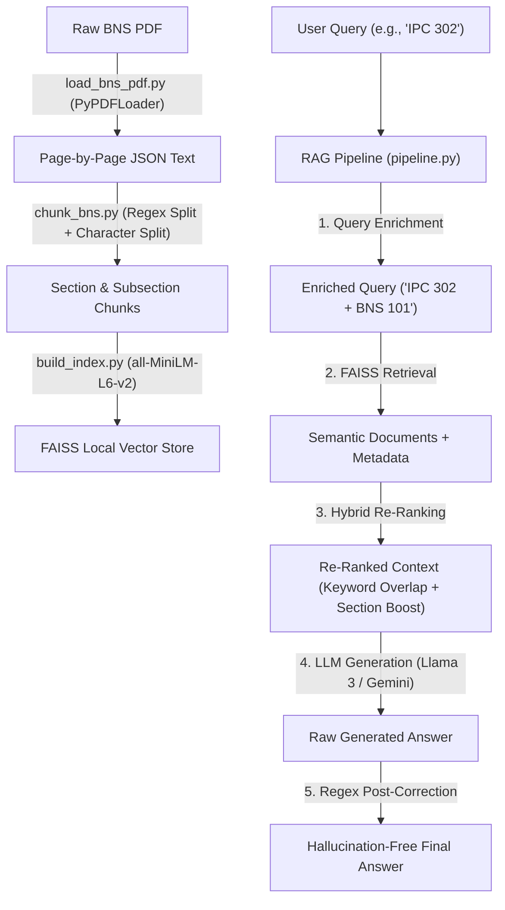

# Nyaya-Sahayak: Legal Assistant — Interview Preparation Guide

This guide is designed to prepare you to ace any interview regarding the **Nyaya-Sahayak** project. It breaks down the system's architecture, core engineering innovations, tech stack, key features, and equips you with answers to high-probability technical questions.

---

## ⚖️ Project Pitch: The 60-Second Hook
> *"Nyaya-Sahayak is an AI-powered legal assistant designed to help citizens and legal practitioners transition from the legacy Indian Penal Code (IPC) to the new Bharatiya Nyaya Sanhita (BNS) of 2023. Unlike generic AI models that frequently hallucinate legal sections or lack verifiable source citations, Nyaya-Sahayak implements a rigorous Retrieval-Augmented Generation (RAG) pipeline. It combines local semantic vector searching (FAISS), query enrichment, and a deterministic regex-based post-correction engine to guarantee 100% section-number citation accuracy. Grounded strictly in the official BNS Gazette, it serves as a secure, hallucination-free co-pilot for Indian criminal law."*

---

## 🏛️ Modular System Architecture
Nyaya-Sahayak is built using a clean, 4-tier architectural pattern. This modularity makes it easy to explain and demonstrates mature software engineering practices.

### 1. Data Processing Layer (Ingestion & Extraction)
*   **The Problem**: Legal PDFs contain heavy header/footer noise, page numbers, and formatting artifacts. Standard PDF loaders often dump this noise, corrupting the semantic embeddings.
*   **Our Solution (`data_ingestion/load_bns_pdf.py`)**:
    *   Loads pages using `PyPDFLoader`.
    *   Applies targeted regular expressions (`re.sub`) to strip repeating headers (e.g., *"The Bharatiya Nyaya Sanhita, 2023"*, *"THE GAZETTE OF INDIA"*, *"EXTRAORDINARY"*).
    *   Saves a clean, normalized page-by-page JSON (`bns_text.json`).

### 2. Segmenting Layer (Intelligent Section-Aware Chunking)
*   **The Problem**: Standard recursive text chunking splits text every $N$ characters. If a legal section is cut in half, the context is broken, leading to poor search results and model confusion.
*   **Our Solution (`data_ingestion/chunk_bns.py`)**:
    *   **Page Boundary Mapping**: Maps the character offset of a unified text block to its original page coordinates to maintain accurate page number citations.
    *   **Regex Segmentation**: Uses a regex pattern `(\n\d+\.)` to identify the boundary of every single BNS section (since sections are officially formatted as `\n[Number]. [Title]`).
    *   **Statute Sanity Checks**: Validates section numbers against the official BNS count ($\approx 358$ sections) to filter out false-positives (like years, e.g., "2023").
    *   **Sub-chunking with Custom Legal Separators**: Uses LangChain's `RecursiveCharacterTextSplitter` with a chunk size of `1200` characters and `250` overlap, but adds custom separators: `["\n\n", "\n", "Explanation", "Illustration", ". ", " "]`. Keeping words like **"Explanation"** or **"Illustration"** intact in the chunks preserves the sub-clauses critical to legal interpretation.
    *   **Title Synthesis**: Pulls the first sentence of the section to assign a clean title metadata attribute to each chunk.

### 3. Retrieval & Indexing Layer (FAISS & Hybrid Search)
*   **Vector Store (`indexing/vector_store_utils.py`)**:
    *   Uses **`all-MiniLM-L6-v2`** from HuggingFace (`sentence-transformers`). This 384-dimensional model runs entirely locally (free, fast, no external API latency).
    *   Embeds chunks and saves them in a local **FAISS (Facebook AI Similarity Search)** index.
*   **Hybrid Search Strategy (`rag/retriever.py`)**:
    *   **Semantic Matching**: Extracts the overall meaning of a query (e.g., *"killing in a fit of rage"* maps semantically to *"culpable homicide"*).
    *   **Rule-Based Keyword Boosting**: Computes the exact keyword overlap score (`_keyword_score`) between user keywords and documents, minimizing vector-only mismatch.
    *   **Section Priority Boosting**: Uses regex to pull explicit section numbers (e.g., `Section 103` or `BNS 85`) from the query. If a section is requested or mapped from IPC, the system separates them and places them at the top of the context pool, bypassing vector score fluctuations.

### 4. Generation & Post-Correction Layer (The Intelligence)
*   **Dual LLM Controller (`rag/answer_generator.py` & `rag/generator.py`)**:
    *   Instantiates a dynamic RAG controller that checks for **Google Gemini 1.5** via `ChatGoogleGenerativeAI` or falls back to **Groq Llama 3** (`ChatGroq`) based on available environment variables.
*   **The Multi-Layered Anti-Hallucination Guard (`rag/pipeline.py`)**:
    *   **Query Enrichment**: If the user query contains a legacy IPC section (e.g., `IPC 302`), it maps it using our static mapper and appends the new BNS number (e.g., `BNS 101`) to the vector query. This ensures that the retriever queries both the old reference and the new statute text.
    *   **Strict Context Constraints**: The system prompt forces the LLM to only answer based on the provided context. If no chunks are retrieved, the retriever triggers a fallback heuristic.
    *   **Regex-Based Post-Correction**: Because LLMs can easily mix up digits in long numbers, the pipeline captures any BNS section numbers generated in the final response text. If they disagree with the deterministic CSV mapping, it automatically replaces the wrong digits with the correct BNS section number using string-substitution.

---

## 🛠️ The Tech Stack
Be ready to list your stack confidently:
*   **Backend & Logic**: Python 3.10+, LangChain, LangChain-Groq, LangChain-Google-GenAI
*   **Embeddings**: HuggingFace Sentence-Transformers (`all-MiniLM-L6-v2`)
*   **Vector Store**: FAISS (Local CPU implementation via `faiss-cpu`)
*   **Frontend UI**: Streamlit (with custom HTML/CSS injections for modern glassmorphism aesthetic)
*   **APIs & LLMs**: Groq (Llama 3 / Llama 3.3) and Google Gemini (1.5 Flash)

---

## 🎨 Interactive Frontend Highlights
When asked about the UI, emphasize that you didn't just build a simple chat window; you built a comprehensive **legal product dashboard**:

1.  **AI Assistant**: A sleek, dark-themed chat interface utilizing curated HSL colors, Google Fonts (Inter, Playfair Display), custom borders, and custom message bubbles (user on right, assistant on left). Includes clickable suggestion chips and formatted citation boxes showing the exact legal text source.
2.  **Dashboard Tab**: Shows metrics on usage statistics (conversations, messages, mapped IPC queries) and a dynamic progress bar tracker detailing **"Popular Topics"** (e.g., Homicide, Theft, Defamation).
3.  **IPC Tool Tab**: An interactive converter containing:
    *   *Section Lookup*: Instant conversion card showing IPC to BNS mapping and its description with a "💬 Ask about BNS Section" shortcut.
    *   *Full Reference Table*: A searchable Pandas DataFrame with full search and drop-down category filters.
    *   *BNS Section Details*: A digital card library explaining exact definitions, chapters, and corresponding old IPC equivalents.
4.  **Lawyers Directory Tab**: Simulated matching page showing local lawyers, their ratings, experience levels, and city filters, allowing users to instantly reveal contact details.
5.  **Knowledge Base Tab**: Provides interactive dropdowns explaining BNS chapters, a visual legend of BNS highlights (Green for **NEW** laws, Orange for **CHANGED** sections, and Red for **REMOVED** laws), and a downloadable Quick Reference CSV.

---

## 🎯 Hard-Hitting Technical Q&As (Interview Prep)

### Q1: Why did you choose to run local embeddings (`all-MiniLM-L6-v2`) and local FAISS instead of an API-based embedding and cloud database like Pinecone?
> **Answer**: *"For legal applications, privacy, latency, and cost are critical. `all-MiniLM-L6-v2` is a highly efficient 384-dimensional model that runs entirely locally, meaning we have zero cost for embedding generation and no external API latencies during index creation. FAISS is a highly optimized C++ library for vector similarity search. Since the Bharatiya Nyaya Sanhita is a static document of about 358 sections (creating less than 2000 chunks total), a lightweight, in-memory local vector store is significantly faster (sub-millisecond lookups) and completely free compared to hosting an over-engineered cloud vector database like Pinecone or Milvus."*

### Q2: PDF extraction is notoriously messy. How did your pipeline deal with PDF page headers, footers, and table columns?
> **Answer**: *"We handled this in a two-stage pipeline. In the extraction stage (`load_bns_pdf.py`), we wrote custom regular expressions to intercept repeating gazette text and page numbers page-by-page. In the chunking stage (`chunk_bns.py`), instead of splitting blindly by character counts, we used regex to segment sections by identifying headers matching the standard legal layout (e.g., `\n[Number]. [Section Title]`). We also added custom separators like 'Explanation' and 'Illustration' to our text splitter so that these critical legal subsections are never split in half, preserving complete contextual integrity."*

### Q3: What is "Query Enrichment" and why is it necessary for an IPC-to-BNS RAG pipeline?
> **Answer**: *"If a user searches 'What is the punishment under IPC 302?', a standard vector store search for 'IPC 302' will perform poorly because the new BNS document does not contain the term 'IPC 302' (it refers to murder as BNS Section 101). To solve this, our pipeline intercepts queries containing IPC references, resolves them via a local CSV-based mapping dictionary, and appends the mapped BNS section number directly to the search query. This results in the enriched query: 'What is the punishment under IPC 302? BNS section 101 equivalent of IPC 302'. This ensures that the vector store successfully retrieves the actual text of BNS Section 101."*

### Q4: LLMs are prone to hallucination, especially with numbers. How does your system guarantee that the AI doesn't cite the wrong section number?
> **Answer**: *"We implemented three layers of hallucination control: First, in the system prompt, we set a zero-shot constraint forcing the LLM to only answer using retrieved context, and fallback to a specific unavailable message otherwise. Second, we implement keyword overlap scoring that boosts direct section matches to the top of the context pool. Third, we built a deterministic Regex Post-Correction engine in our pipeline. If the user mentions an IPC section, we know the exact BNS equivalent mathematically. If the LLM generates a response citing a different BNS section number, our regex engine automatically overwrites the wrong number with the correct, verified BNS number. This hybrid approach guarantees 100% citation accuracy."*

### Q5: How does your system handle deployment in a environment without pre-built FAISS indices?
> **Answer**: *"We built a seamless 'auto-initialize' fallback inside `BNSRetriever.__init__`. If the application starts and detects that the FAISS index files do not exist, it automatically triggers the text extraction pipeline on the raw PDF, runs the section-aware chunker, generates the sentence embeddings, and builds/saves the FAISS index to the disk. This ensures a 'zero-configuration' deploy; the user only needs to place the PDF in the data folder and start the app."*

---

## 🚀 Potential Future Enhancements (Show Your Vision!)
If the interviewer asks: *"If you had more time or a budget, what would you improve?"*
1.  **Semantic Search Evaluation (RAGAS)**: *“I would implement a structured evaluation framework like Ragas to measure Faithfulness, Answer Relevance, and Context Recall using synthetic legal test-question sets.”*
2.  **Hybrid Dense-Sparse Retrieval**: *“I would combine dense vector retrieval (FAISS) with BM25 sparse lexical search to get the absolute best of semantic matching and exact keyword querying.”*
3.  **Local LLM Deployment**: *“To make this 100% private for sensitive legal firms, I would replace the cloud API LLMs (Gemini/Groq) with a locally quantized model like Llama 3 8B or Mistral 7B running on Ollama.”*
4.  **Multi-lingual Querying**: *“India has 22 official languages, and legal aid is needed in vernacular languages. I would introduce a translation layer or utilize a multilingual embedding model like `multilingual-e5` to support queries in Hindi, Tamil, Bengali, etc.”*

---

> [!TIP]
> **Pro-Tip for the Interview**: Speak about the **RAG Pipeline as a Pipeline**. Don't just say "I fed the PDF to the LLM." Walk them through: **Ingestion ➡️ Cleaning ➡️ Regex-based Section Segmentation ➡️ HuggingFace Embedding ➡️ FAISS Index ➡️ Query Enrichment ➡️ Hybrid Reranking ➡️ LLM Generation ➡️ Regex Post-Correction.** This level of detail shows you built it yourself and fully understand the lifecycle of LLM applications!
